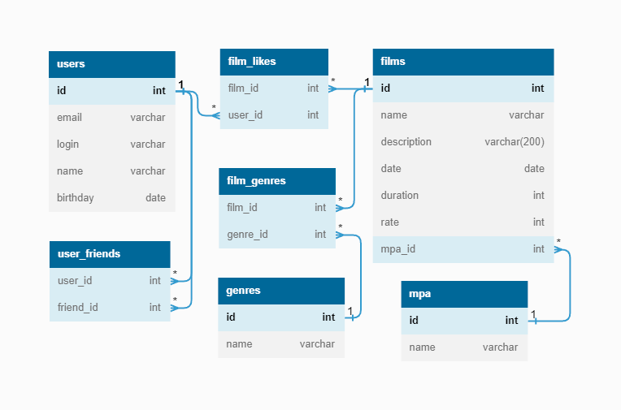

<h1 align="center">Filmorate</h1>

## Описание
Spring Boot приложение для работы с фильмами и оценками пользователей.

## Схема базы данных


#### Таблица films хранит информацию о фильмах:
- id - идентификатор фильма;
- name - название фильма;
- description - краткое описание фильма;
- date - дата выпуска фильма;
- duration - продолжительность фильма;
- rating - MPAA рейтинг фильма.

#### Таблица films_genre содержит идентификаторы жанров для фильмов:
- film_id - идентификатор фильма;
- genre_id - идентификатор жанра.

#### Таблица genre хранит список жанров:
- genre_id - идентификатор жанра;
- name - название жанра.

#### Таблица users хранит информацию о пользователях:
- id - идентификатор пользователя;
- email - эл.почта пользователя;
- login - логин пользователя;
- name - имя пользователя;
- birthday - дата рождения пользователя.

#### Таблица user_likes хранит информацию о пользователях оценивших фильмы
- film_id - идентификатор фильма;
- user_id - идентификатор пользователя.

#### Таблица user_friends хранит данные о друзьях пользователя
- user_id - идентификатор пользователя;
- friend_id - идентификатор друга;
- is_accepted - статус заявки в друзья.

## Примеры запросов
- добавление фильма
```sql
 INSERT INTO films (name, description, date, duration, rating)
 VALUES (?, ?, ?, ?, ?)
 ```

- добавление пользователя
```sql
 INSERT INTO users (email, login, name, birthday)
 VALUES (?, ?, ?, ?)
 ```

- получение информации о пользователе по id
 ```sql
 SELECT *
 FROM users
 WHERE id = ?
 ```

- получение информации о фильме по id
```sql
 SELECT *
 FROM films
 WHERE id = ?
 ```

- получение списка популярных фильмов
```sql
 SELECT f.*
 FROM films f
 LEFT JOIN film_likes AS fl ON f.id = fl.film_id
 GROUP BY f.id
 ORDER BY COIUNT(fl.user_id) desc, f.rate desc
 LIMIT ?
```
